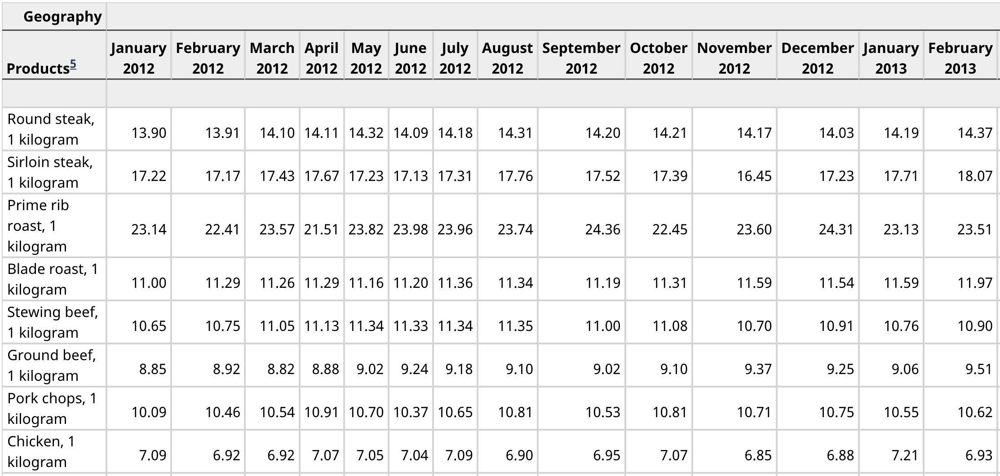
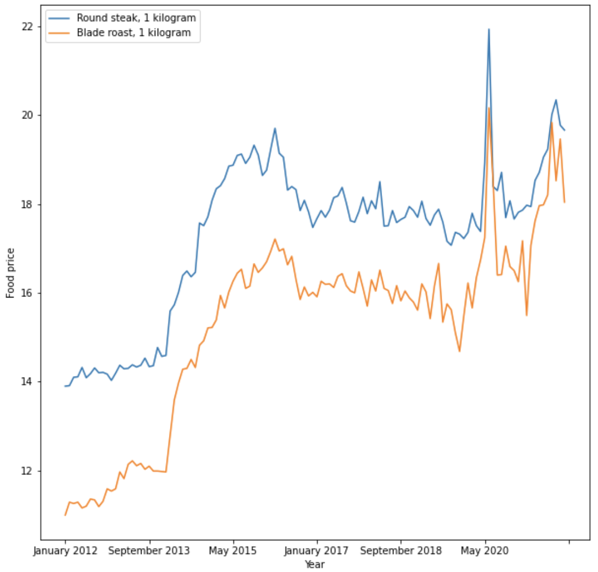

# Data Exploration
Data exploration is the initial step in data analysis, which refers to exploring a large dataset to uncover initial patterns, characteristics, and points of interest. The purpose is not to reveal every bit of information a dataset holds, but rather to help create a broad picture of important trends and major points to study in greater detail.

Data exploration involves summarizing and realizing the dataset and it usually uses visualization because it creates a more straightforward view of datasets. 

In this tutorial, we'll walk you through exploratory data analysis of [Monthly Average Retail Prices](https://www150.statcan.gc.ca/t1/tbl1/en/tv.action?pid=1810000201&cubeTimeFrame.startMonth=01&cubeTimeFrame.startYear=2012&cubeTimeFrame.endMonth=12&cubeTimeFrame.endYear=2021&referencePeriods=20120101%2C20211201) step by step.

### **Dataset Explanation**
This dataset consists of monthly average retail prices for food and some essentials between 2012 and 2021:


### **Goals**
The goal of this project is to practice data cleaning, analysis and visualization skills using Python Pandas, Numpy and Matplotlib.
We'll first import the dataset, then perform some processing with it to make it a bit more cleaner, and we're using the clean version to get some insights. After that, we will generate some trend charts at the end.

Following are the steps that we'll perform:

1. Data Preprocessing
2. Data Analysis
3. Data Visualization

### Requirement
- [Jupyter](https://jupyter.org/)
- [Matplotlib](https://matplotlib.org/)
- [Pandas](https://pandas.pydata.org/docs/)
- [Numpy](https://numpy.org/)

### Quick Start
```
# Install all dependencies
pip3 install notebook numpy pandas matplotlib

# Run 
jupyter notebook
```

### Quick Guide
#### **1. Data Preprocessing**
Before we get into analyzing it, we need to standardize the dataset, this might be including removing unwanted row/column/data, converting data types, fixing structural errors, handling missing data, etc. We will be using Pandas for this preparation step.

The goal of this step is to convert the [Monthly Average Retail Prices](https://www150.statcan.gc.ca/t1/tbl1/en/tv.action?pid=1810000201&cubeTimeFrame.startMonth=01&cubeTimeFrame.startYear=2012&cubeTimeFrame.endMonth=12&cubeTimeFrame.endYear=2021&referencePeriods=20120101%2C20211201) (→ **INPUT**) into a clean dataframe. The desired **OUTPUT** would look like:


...


#### **2. Data Analysis**
After preprocessing it, we have a clean dataset. With this dataset, we're ready to do further analysis. In this step, we're going to calculate some indexes:
    
- 2.1. Calculate the `CPI (Consumer Price Index)` in 2021

    Formula:
    ```
    CPI_t = (C_t/C_0)*100
    CPI_t = Consumer price index in current period
    C_t = Cost of market basket in current period
    C_0 = Cost of market basket in base period
    
    Cost of market basket = Total Expenditure
    Total Expenditure = Sum the Product Price x Quantity in each year
    
    e.g.:
    Year 2020 Product A price: 25, Quantity: 1 kg
    Year 2020 Product B price: 20, Quantity: 2 kg
    Assume that the market basket (the amount purchased) is the quantity provided in the dataset.
    Total expenditure in 2020 = (25 * 1) + (20 * 2) = 65
    ```
    We're taking 2012 as base year, hence we can get the CPI 2021 by:
    ```
    CPI 2021 = (Cost of market basket in 2021/Cost of market basket in 2012) x 100
    ```

- 2.2. Calculate the `Inflation Rate` between 2012 and 2021

    Formula:
    ```
    Inflation Rate = [(Current CPI - Previous CPI) / Previous CPI] x 100
    ```
    In this case, `Inflation Rate` will be: 
    ```
    [(CPI 2021 - CPI 2012) / CPI 2012] x 100
    ```
    [Formula example reference](https://www.uvm.edu/~awoolf/classes/spring2005/ec11/calculating_inflation.html)


#### **3. Data Visualization**
In the step, we're going to create some plots using Matplotlib.

- 3.1. Plot the entire dataset. 

    Create a simple line chart from the dataset, set the timeline (Years and Months) on x-axis and the 'Product Price' on y-axis.

- 3.2. Plot specific products. For example:

    