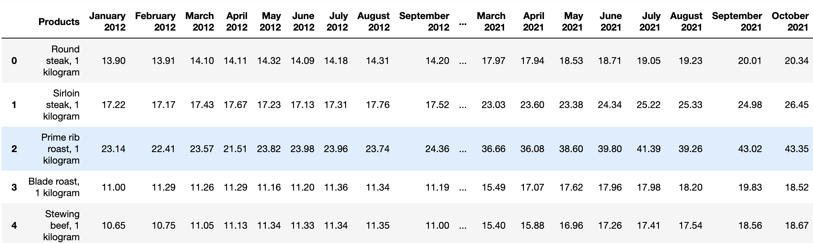
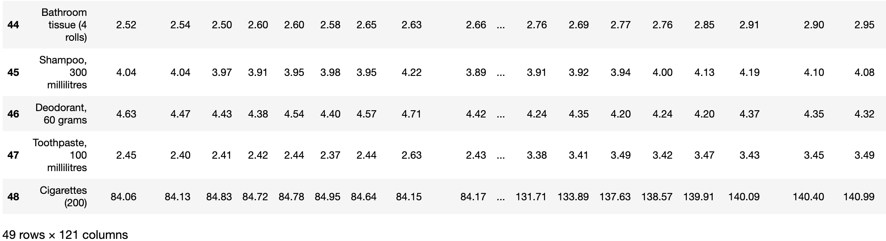

# Exploratory Data Analysis

In this tutorial, we are going to do some analysis and generate statistical plots with  [Consumer Price Index dataset](https://www150.statcan.gc.ca/t1/tbl1/en/tv.action?pid=1810000201&cubeTimeFrame.startMonth=01&cubeTimeFrame.startYear=2012&cubeTimeFrame.endMonth=12&cubeTimeFrame.endYear=2021&referencePeriods=20120101%2C20211201).

- Dataset explanation:
This dataset involves monthly average retail prices for food and essentials from 2012 to 2021.
We will perform the following steps:

#### **1. Data Preprocessing**
Before we get into analyzing it, we need to standardize the dataset, this might be including removing unwanted row/column/data, converting data types, fixing structural errors, handling missing data, etc. We will use Pandas for this preparation step.

Our goal for this step is to convert the [Consumer Price Index dataset](https://www150.statcan.gc.ca/t1/tbl1/en/tv.action?pid=1810000201&cubeTimeFrame.startMonth=01&cubeTimeFrame.startYear=2012&cubeTimeFrame.endMonth=12&cubeTimeFrame.endYear=2021&referencePeriods=20120101%2C20211201) into a clean dataframe. The desired output after the preprocessing would look like:


...

#### **2. Data Analysis**
After preprocessing it, we have a clean dataset. With this dataset, we're ready to do further analysis and get some useful insights from it.
We will calculate the `CPI(Consumer price index)` and `Inflation Rate`:  
    
- a. Calculate the CPI (Consumer price index) in 2021
    Formula:

    ```
    CPI_t = (C_t/C_0)*100
    CPI_t = consumer price index in current period
    C_t = cost of market basket in current period
    C_0 = cost of market basket in base period
    ```
    We're taking 2012 as base year, hence we can calculate the CPI 2021 by following:
    ```
    CPI 2021 = (cost of market basket in 2021/cost of market basket in 2012)*100
    ```

- b. Calculate the inflation rate between 2012 and 2021
    Formula:
    ```
    Inflation Rate = Current CPI - Previous CPI/Previous CPI x 100
    ```


#### **3. Data Visualization**
In the step, we're going to generate some plots using Matplotlib.

- a. Plot the entire dataset with 'Years' as x axis and 'Products' as y axis.
- b. Plot one given column


### Requirement
- [Jupyter](https://jupyter.org/)
- [Matplotlib](https://matplotlib.org/)
- [Pandas](https://pandas.pydata.org/docs/)
- [Numpy](https://numpy.org/)

### Quick Start
```
# Install all dependencies
pip3 install notebook numpy pandas matplotlib

# Run 
jupyter notebook
```